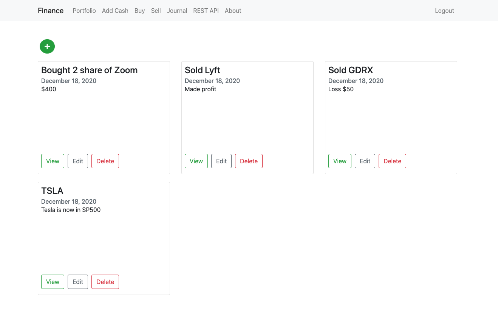
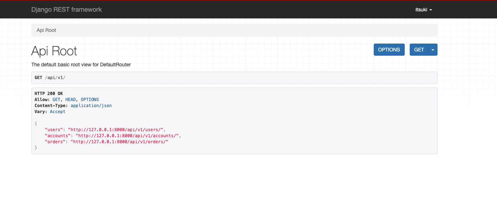

# Stock Management Application
This is a stock full-stack application where you can buy, sell and organize your stock

### Register page


### Login page


### Portofolio page


### Buy page


### Sell page


### Journal page


### REST API page


### About page


## Running it locally 
```
python manage.py runserver
```
✍️ Use this username and password to log in if you don't like to register\
username: `itsuki`\
password: `7777`


## Stack

- [Django](https://www.djangoproject.com/)
- [GCP](https://console.cloud.google.com/) for deployment
## License

[MIT](https://choosealicense.com/licenses/mit/)

## Author

Itsuki Tomizawa

